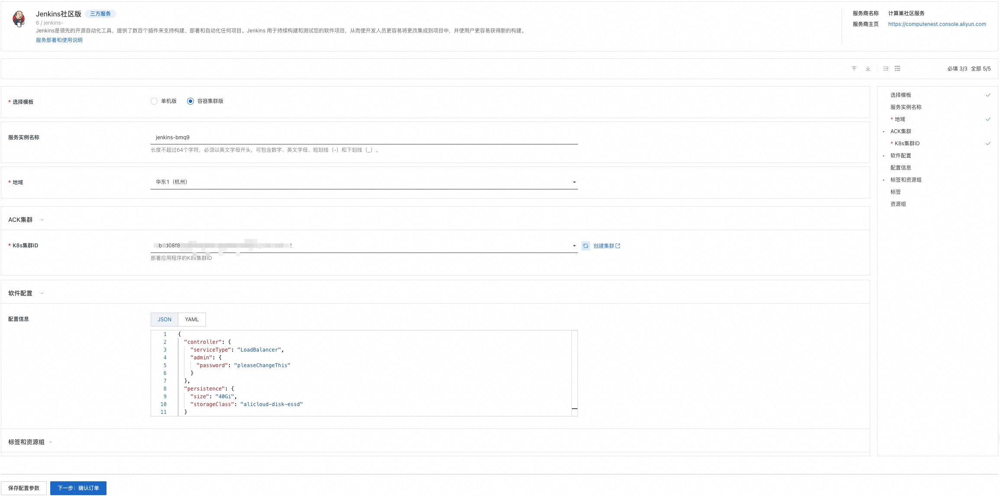
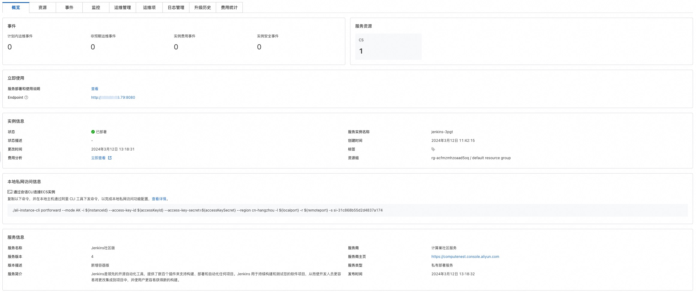
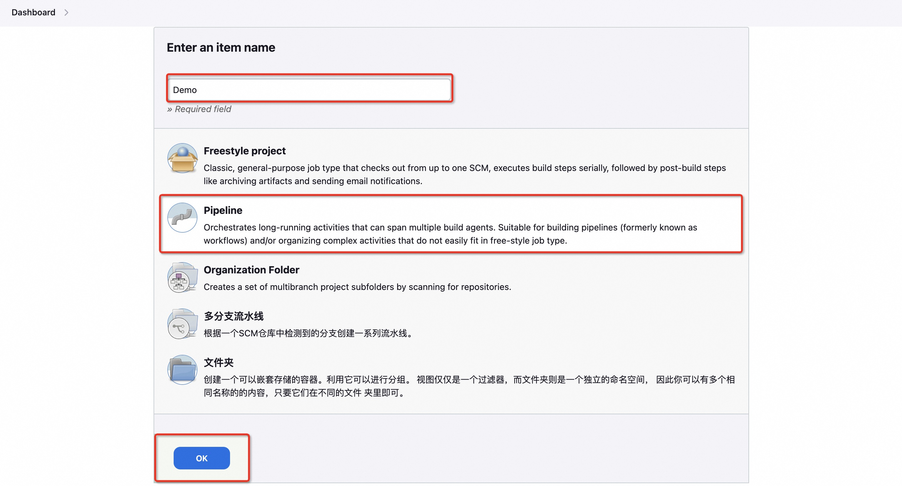
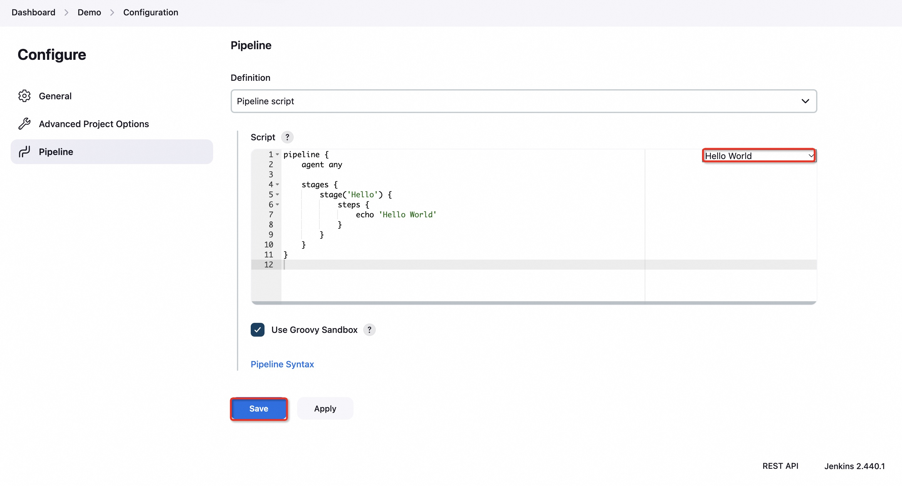
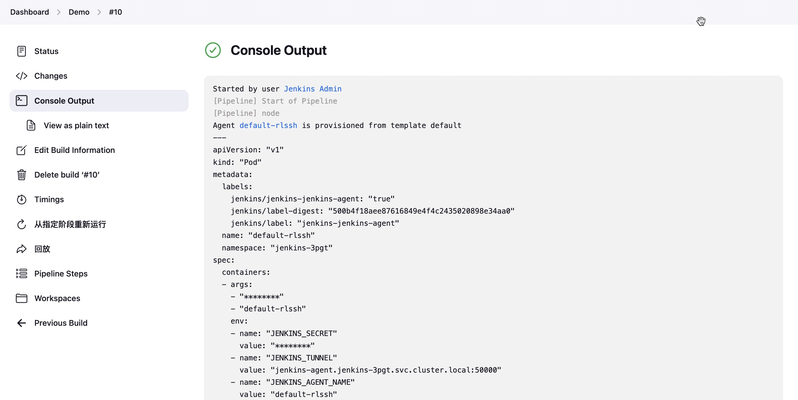

# 在ACK Serverless集群中部署Jenkins

## 概述

Jenkins是一个开源软件项目，是基于Java开发的一种持续集成工具，用于监控持续重复的工作，旨在提供一个开放易用的软件平台，使软件项目可以进行持续集成。Jenkins在计算巢上提供了社区版服务，您无需自行配置云主机，即可在计算巢上快速部署Jenkins服务、实现运维监控，从而方便地基于Jenkins搭建您自己的应用。本文向您介绍如何开通计算巢上的Jenkins社区版服务，以及部署流程和使用说明。

## RAM账号所需权限

Jenkins服务需要对ECS、VPC等资源进行访问和创建操作，若您使用RAM用户创建服务实例，需要在创建服务实例前，对使用的RAM用户的账号添加相应资源的权限。添加RAM权限的详细操作，请参见[为RAM用户授权](https://help.aliyun.com/document_detail/121945.html)
。所需权限如下表所示。

| 权限策略名称                          | 备注                         |
|---------------------------------|----------------------------|
| AliyunECSFullAccess             | 管理云服务器服务（ECS）的权限           |
| AliyunVPCFullAccess             | 管理专有网络（VPC）的权限             |
| AliyunROSFullAccess             | 管理资源编排服务（ROS）的权限           |
| AliyunComputeNestUserFullAccess | 管理计算巢服务（ComputeNest）的用户侧权限 |
| AliyunCloudMonitorFullAccess    | 管理云监控（CloudMonitor）的权限     |
| AliyunCSFullAccess              | 管理云监控（CloudMonitor）的权限     |

## 部署流程

### 部署步骤

单击[部署链接](https://computenest.console.aliyun.com/user/cn-hangzhou/serviceInstanceCreate?ServiceId=service-5789653a5cbe4817a4a7)
，进入服务实例部署界面，选择**容器集群版**，根据界面提示填写参数完成部署。

### 部署参数说明

您在创建服务实例的过程中，需要配置服务实例信息。下文介绍Jenkins社区版服务实例输入参数的详细信息。

| 参数组     | 示例                                                                                                                                                        | 说明                              |
|---------|-----------------------------------------------------------------------------------------------------------------------------------------------------------|---------------------------------|
| 服务实例名称  | jenkins-3pgt                                                                                                                                              | 实例的名称                           |
| 地域      | 华东1（杭州）                                                                                                                                                   | 选中服务实例的地域，建议就近选中，以获取更好的网络延时。    |
| k8s集群Id | c377ad508***********                                                                                                                                      | 部署应用程序的K8s集群ID                  |
| 软件配置信息  | `{"controller": { "serviceType": "LoadBalancer","admin": {"password": "Password"}},"persistence": {"size": "40Gi","storageClass": "alicloud-disk-essd"}}` | Jenkins软件的配置信息(账号为admin, 请修改密码) |

### 执行Jenkins构建任务

1. 服务实例创建成功后，进入服务实例概览页，可以通过Endpoint和AdminPassword登录 Jenkins。

   

2. 在左侧导航栏单击New Item。 在Enter an item name区域，输入名称（Demo），选择Pipeline类型，然后单击OK。

   

3. 在页面顶部单击Pipeline页签，选择Hello World模板，配置pipeline，然后单击Save。

   

4. 在页面左侧导航栏中，单击Build Now执行构建。在构建流水线时，Jenkins会默认从当前ACK集群中动态启动一个Slave Pod并执行构建任务，构建任务执行完毕后会立即释放该Slave Pod。

   

5. 通过计算巢服务实例资源栏，登录到容器服务控制台。

   

6. 容器组中可查看由Jenkins构建任务创建的Slave Pod。

   

7. 在Jenkins页面左侧导航栏中，单击Build History，单击目标流水线进入详情页面，然后单击Console Output即可查看流水线构建结果。

   

### 使用抢占式ECI实例执行Jenkins构建任务

注意事项：
使用该功能时，请确保集群中的VK（ack-virtual-node组件）为最新版本。关于如何升级组件，请参见[管理组件](https://help.aliyun.com/zh/ack/ack-managed-and-ack-dedicated/user-guide/manage-system-components)。

1. 参考[配置说明](https://help.aliyun.com/document_detail/185127.html)修改eci-profile中的selectors属性为：

   `"[{\n\t\"name\": \"selector-eci\",\n\t\"namespaceSelector\": {\n\n\t\t\"matchLabels\": {\n\t\t\t\"type\": \"eci\"\n\t\t}\n\t},\n\t\"effect\": {\n\t\t\"annotations\": {\n\t\t\t\"k8s.aliyun.com/eci-spot-strategy\": \"SpotAsPriceGo\"\n\t\t}\n\t}\n}]"`

   

2. 编辑Jenkins的命名空间并添加标签：
   
   `type：eci`

   

3. 运行Jenkins构建任务，Jenkins会默认从当前ACK集群中动态启动一个抢占式ECI Pod并执行构建任务。
   
   

4. 在ECI控制台可以看到对应的ECI实例，构建任务执行完毕后会立即释放该ECI实例。

   

